# HABIT TRACKER APP
## About
A Habit Tracker App where users can track  daily habits.
## Tech Stack
- React, React Router v6
- Mock Backend
## Features
- Home Page
    - All Habits
- Habits Progress Section
    - Users can track habits, edit habits, delete habit habit
    - Display Progress using Calendor & Chart.js
- Archive Habit Page
- Pomodoro Feature
- Search Habit By Habit Title
- JWT based Authentication
    - Log In
    - Sign Up
    - Log Out

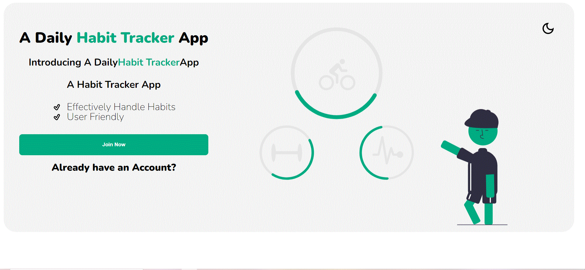
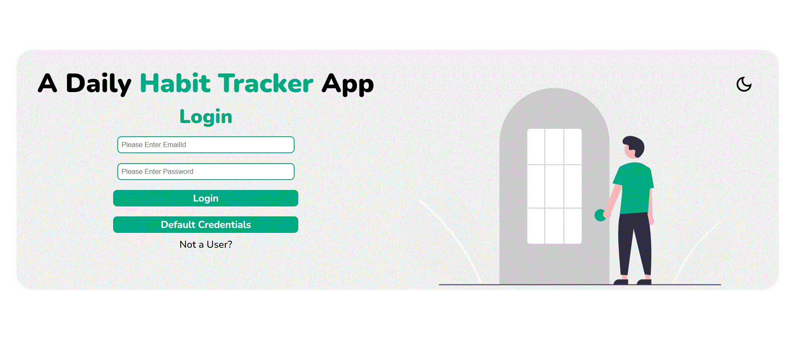
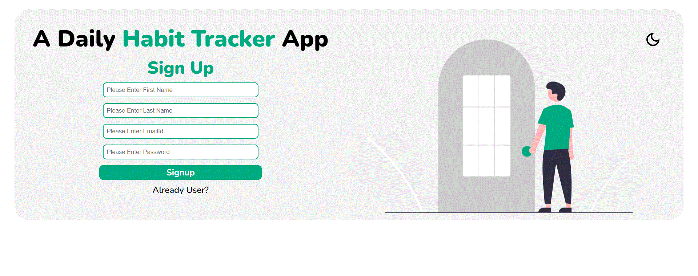
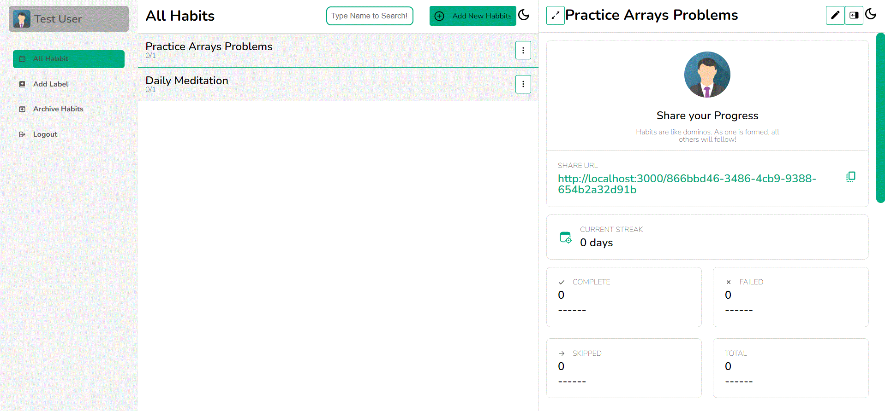
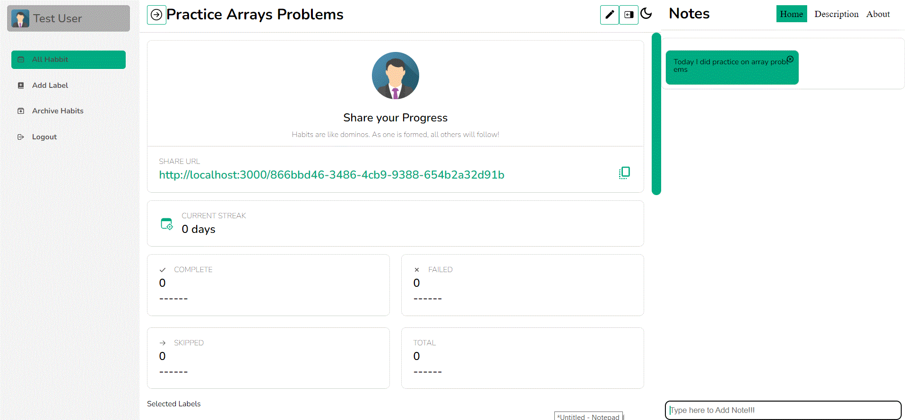
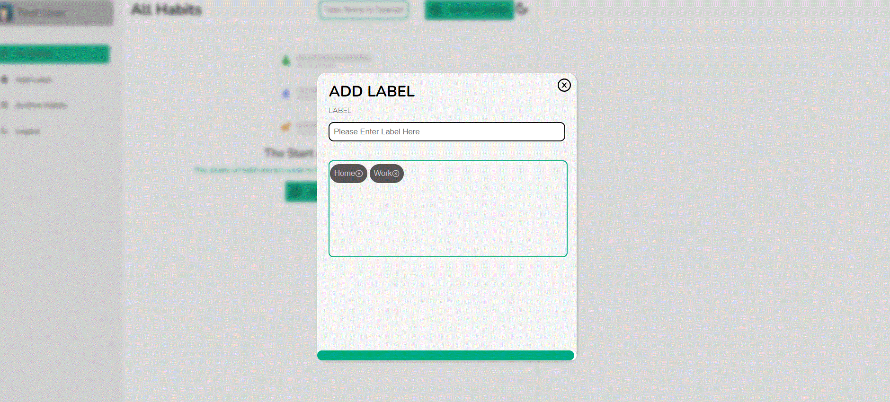

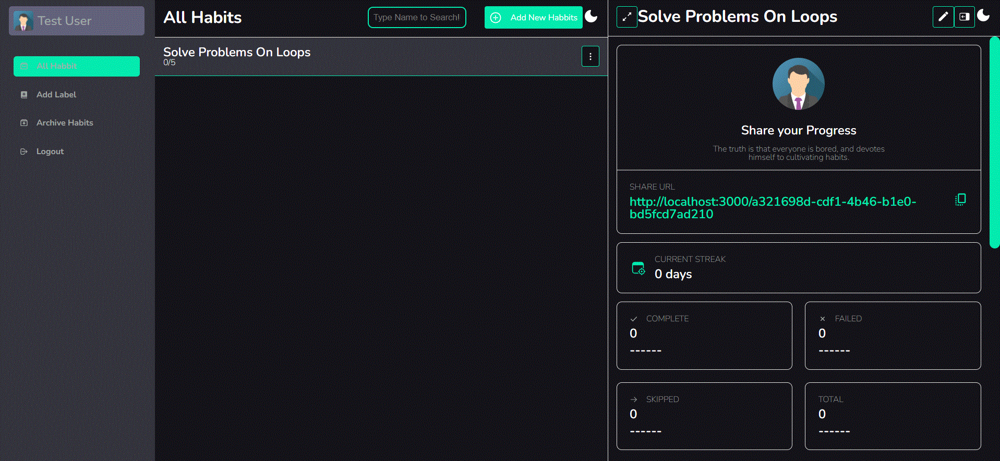
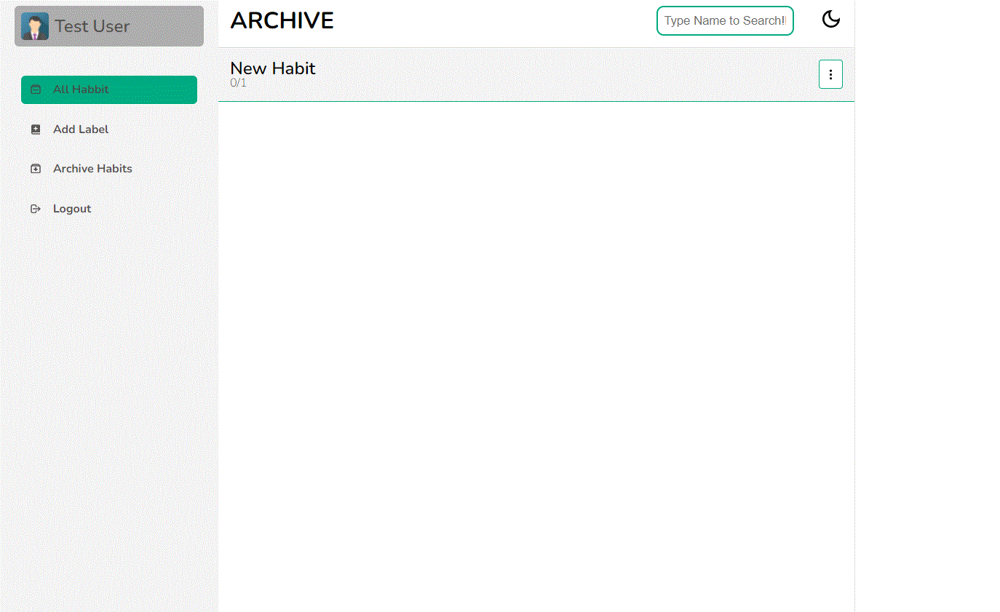
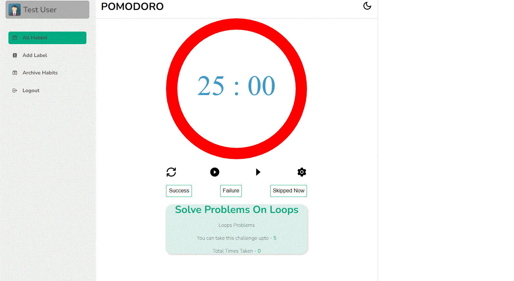
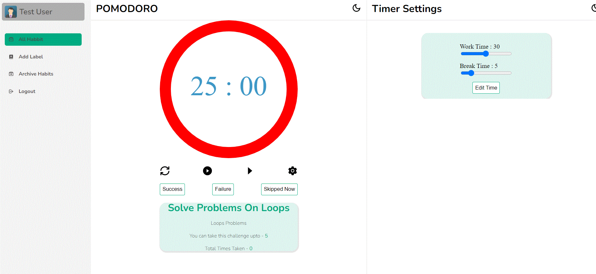
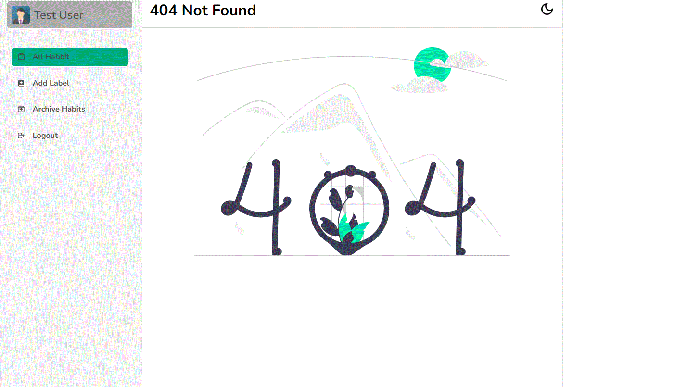

